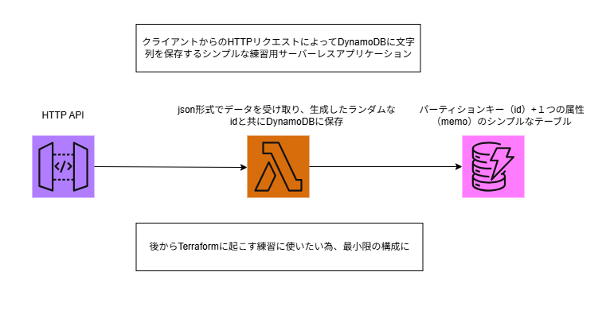

# Simple Serverless API with Terraform (AWS)

AWS Lambda（Python）＋API Gateway＋DynamoDB を使った、  
**文字列データを保存するだけのシンプルなサーバーレス API** です。

AWS構築および Terraform の基礎学習目的で作成した最小構成のサーバーレスアプリケーションです。  
Terraform を使うことで、AWS リソースをコードとして管理し、同じ構成をいつでも再現できるようにしています。

---

## 🚀 概要

このアプリは、クライアントから送られたテキストを DynamoDB に保存するだけの  
ミニマルな API です。

- POST で文字列を送ると DynamoDB に保存  
- Lambda（Python）で処理  
- API Gateway がエンドポイントを公開  
- DynamoDB は PK とメモ内容のみのシンプルなテーブル構成  

---

## 🏗 構成図




---

## 🔧 技術スタック

- AWS Lambda (Python 3.12)
- Amazon API Gateway (HTTP API)
- Amazon DynamoDB
- Terraform

Terraform によって、これらのリソースが自動的に作成・紐付けされます。（IAMロールとポリシーの作成・付与も含む）
---

## 📡 API 仕様（POST /memo）

この API は、クライアントから送られたメモを DynamoDB に保存するためのシンプルな POST API です。Lambda が受け取ったメモを UUID とともに DynamoDB に保存します。

### エンドポイント（例）
POST https://{api-id}.execute-api.{region}.amazonaws.com/memo  
※ `{api-id}` と `{region}` は Terraform apply 後の output で確認できます。
※ API GatewayをHTTP API のステージ名：$defaultで構成しているため、エンドポイントにステージ名は付きません。

### リクエスト
HTTP メソッド: POST  
Content-Type: application/json  

リクエストボディ（JSON）
```
{
  "memo": "メモ内容"
}
```

### Lambda 内部処理の流れ
1. event['body'] を JSON としてパース  
2. memo を取り出す  
3. uuid.uuid4() で一意の ID を生成  
4. DynamoDBに以下の形式で保存  
```
{
  "id": "自動生成されたUUID",
  "memo": "送信されたメモ内容"
}
```

### レスポンス
成功時（200 OK）
```
{
  "message": "saved"
}
```

エラー時（例）
```
{
  "message": "Internal server error"
}
```

### DynamoDB のデータ構造
| 属性名 | 型     | 説明                       |
|--------|--------|----------------------------|
| id     | string | UUID（パーティションキー） |
| memo   | string | メモの内容                 |

### 認証
この API は学習用のため認証なし（public）でアクセス可能です。


ディレクトリ構成
```
.
├── src/
│   └── lambda_function.py     lambda関数のコード
├── terraform/
│   ├── main.tf                terraformの記載はファイルを分けず全てここに記載
│   ├── .terraform.lock.hcl    terraformでデプロイした際に自動生成される、プロバイダのバージョン固定ファイル
│   └── lambda.zip             lambda_function.pyをzip化したもの。	terraformでのデプロイ時に使用
├── .gitignore
├── architecture.drawio
├── architecture.png            構成図
└── README.md
```

Lambda Code (lambda_function.py)
※ 実際のコードは src/lambda_function.py にあります。

---

## 🚀 セットアップ手順
main.tfとlambda.zipを配置しているディレクトリで以下コマンドを実行

### 1. 初期化
Terraform のプラグインやモジュールをダウンロードします。

```
terraform init
```

### 2. プラン確認
どのリソースが作成・変更・削除されるかを確認します。

```
terraform plan
```

### 3. デプロイ（作成）
AWS 上にインフラを構築します。

```
terraform apply
```
→完了後、APIのエンドポイントが表示されます。

動作確認方法（例）：以下コマンドでAPIにPOSTリクエスト
```
curl -X POST \
  -H "Content-Type: application/json" \
  -d '{"memo": "メモ内容"}' \
  https://{api-id}.execute-api.{region}.amazonaws.com/memo
```
  
上記コマンド実行後、
```
{
  "message": "saved"
}
```
と表示されれば、DynamoDBに"メモ内容"が保存されます。

### 4. 削除（destroy）
作成したリソースをすべて削除します。

```
terraform destroy
```

---

## 🎯 学習目的

- Terraform の基本操作（init / plan / apply / destroy）
- AWS サーバーレス構成の理解
- IaC（Infrastructure as Code）の実践

---

## 📄 ライセンス

このリポジトリは学習目的で作成されています。  
必要に応じて自由に改変して利用してください。